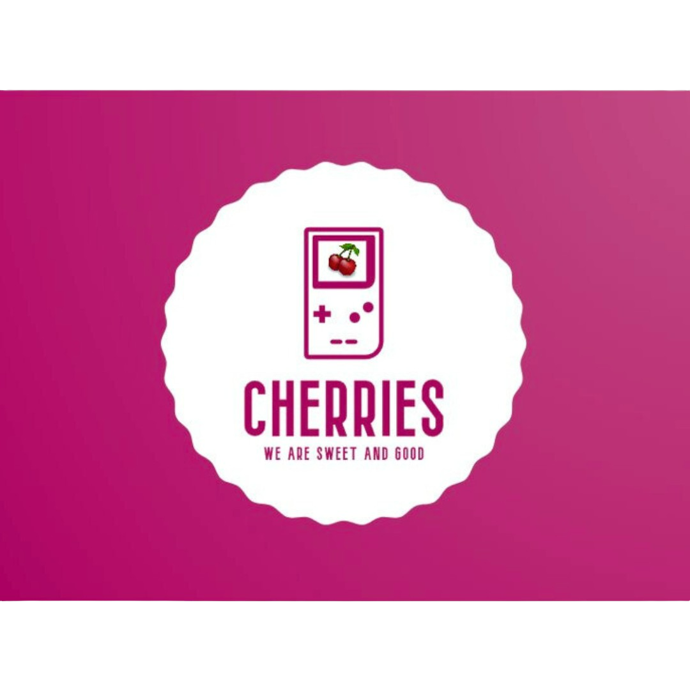
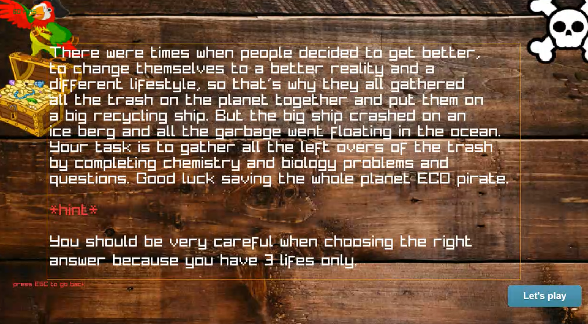

<h1 align="center">Cherries</h1>

<p align = "center">
 
</p>

<br>

<p align = "center">
  
  
  
  
</p> 

## 📋 Description
There were times when people decided to get better, to change themselves to a better reality and a different lifestyle, so that's why they all gathered all the trash on the planet together and put them on a big recycling ship. But the big ship crashed on an iceberg and all the garbage went floating in the ocean. Your task is to gather all the leftovers of the trash by completing chemistry and biology problems and questions. Good luck saving the whole planet ECO pirate.

## 🚀 Languages and Libraries
<p align="left">
  <a href="https://www.cplusplus.com/"></a>
  <a href="https://www.raylib.com/"></a>
</p>

## 🗂 Used technologies
<p align="left">
  <a href="https://visualstudio.microsoft.com/"></a>
  <a href="https://code.visualstudio.com/"></a>
  <a href="https://www.microsoft.com/en-ww/microsoft-365/word"></a>
  <a href="https://www.microsoft.com/en-us/microsoft-365/powerpoint"></a>
  <a href="https://www.microsoft.com/en-us/microsoft-365/excel"></a>
  <a href="https://www.adobe.com/"></a>
  <a href="https://git-scm.com/"></a>
  <a href="https://git-scm.com/"></a>
</p> 

## 📝 Documents
 
<h4>Documents</h4>
  <ul>
    <li><a href="Chemistry-and-biology-project/Documentation/Cherries_Documentation.docx">Documentation</a></li>
    <li><a href="Chemistry-and-biology-project/Documentation/">QA Test Plan</a></li>
    <li><a href="Chemistry-and-biology-project/Documentation/">QA Table</a></li>
  </ul> 
<h4>Presenting</h4>
  <ul>    
    <li><a href="Chemistry-and-biology-project/Documentation/Cherries_Presentation (1).pptx">Presentation</a></li>
  </ul> 
   


## 📥 Installation
```
You can download our project by using the green "Code" button.

Or by pasting the following code in your CMD:
git clone https://github.com/TDTanev21/Chemistry-and-Biology-project-team-Cherries.git
```

## ⚙ Website Access

*You can access our website by pasting this link into your browser.*
```
  https://github.com/TDTanev21/Chemistry-and-Biology-project-team-Cherries.git
```

## 👨🏻‍💻 Team Members

| **Name** | **Role** | **Grade** |
| :---:   | :---: | :---: |
| Miroslav Ganev | *Scrum trainer* | 🟨 10A |
| Lazar Apostolov | *Front-end developer*  | 🟥 10B |
| Georgi Ivanov | *Back-end developer*  | 🟩 10V |
| Teodor Tanev |  *Back-end developer*  | 🟦 10G |


## 🎮 ECO Pirates



